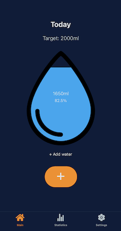

# Droplet 💧


**Droplet** is a mobile application designed to help users monitor and improve their daily water intake. Whether you're someone who always forgets to drink enough water or someone who's trying to meet a specific hydration goal, Droplet has got your back.

### Availability:
Droplet is still in development, but will soon be published on Google Play Store!

---

## Features 🌟

- **Daily Tracking**: Easily log your water intake throughout the day.

- **Weekly Insights**: Visualize your weekly water intake with intuitive line charts to see how you're doing over time.

- **Goals**: Set daily hydration goals and measure your progress.


## Screenshots 📸

| Daily Tracking | Weekly Insights |             Customization             |
|:---:|:---:|:-------------------------------------:|
|  |  |  |


## Technologies Used 💻

- **React Native**: For a smooth, native mobile experience.
- **Expo**: The application uses expo for development

---

## Getting Started 🚀

1. **Clone the repository**:
   ```bash
   git clone https://github.com/Faich/Droplet.git
   ```

2. **Navigate into the directory**:
   ```bash
   cd Droplet
   ```

3. **Install dependencies**:
   ```bash
   npm install
   ```

4. **Start the application**:
      ```bash
      npx expo start
      ```

Follow the instructions in the terminal to open the application in web, mobile device or an emulator.

---

## Contribute 💬

Droplet is a side project, and I'd love any contributions to make it better. Feel free to open issues, offer feedback, or send pull requests!

---

## Connect with Me 🤝

Feel free to reach out to me on [LinkedIn](https://www.linkedin.com/in/joakim-falch-bb9a89210/) for any questions or feedback!

---

